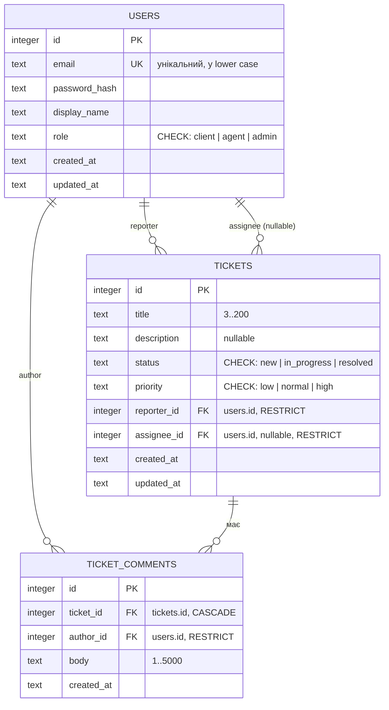

# ER-діаграма: users, tickets, ticket_comments

Схема відповідає моделі даних зі [`specs/spec-01.md`](./specs/spec-01.md): три таблиці, а ролі та статуси —
текстові колонки з `CHECK`, без довідників і таблиць історії.

## Примітки

- Зв'язок `users → tickets` задіяний двічі: `reporter_id` (обов'язковий) і `assignee_id` (опційний).
- `ticket_comments` видаляються каскадом разом із задачею; користувача, на якого є посилання, видалити не можна
  (`RESTRICT`).
- Тип `id` — `INTEGER PRIMARY KEY` у всіх таблицях (вирішено в spec-01, 2026-09-30; альтернативу UUID/TEXT
  відхилено).
- Драйвер — вбудований `node:sqlite` (`DatabaseSync`), Node ≥ 24 (ADR-0001); `INTEGER` ↔ JS `number`, для
  значень, що виходять за межі `Number.MAX_SAFE_INTEGER`, — `setReadBigInts` на рівні statement за потреби.
- Ролі та статуси зберігаються текстом (`users.role`, `tickets.status`, `tickets.priority`), обмеження —
  `CHECK`-констрейнт, а не окремі таблиці-довідники.
